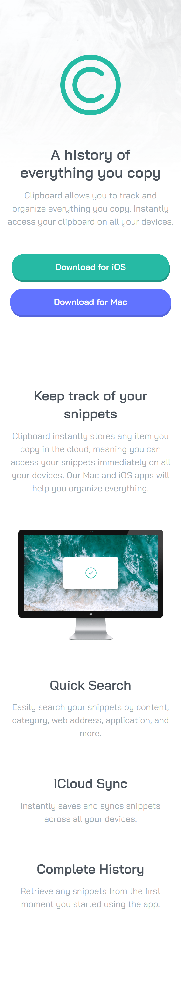

# Frontend Mentor - Clipboard landing page solution 

## Índice

- [Visão geral](#visao-geral)
  - [O Desafio](#o-desafio)
  - [Screenshot](#screenshot)
- [Minha caminhada](#minha-caminhada)
  - [Propriedades](#propriedades)
  - [O que aprendi](#o-que-aprendi)
  - [Recursos](#recursos)
- [Autor](#autor)

## Visão Geral

### O Desafio

Os usuários devem ser capazes de:

- Vizualizar o layout ideal para o site, dependendo do tamanho da tela do dispositivo, mobile ou desktop
- Vizualizar os estados de foco para todos os elementos interativos na página

### Screenshot



## Minha caminhada

### Propriedades

- Mobile-first
- Semântica HTML5
- CSS Flexbox
- CSS Grid


### O que aprendi

Durante a elaboração do header, na criação dos botões, houve um pequeno desafio, o sombreamento. A documentação de box-shadow da MDN foi crucial para o aprendizado dessa propriedade.

Trechos de destaque:

```html
<a href="#" class="botao__primario">Download for iOS</a>
```

```css
.botao__primario {
    display: inline-block;
    background: var(--cor-botao-primario);
    border-radius: 25px;
    text-decoration: none;
    font-weight: 600;
    color: var(--cor-texto-botao);
    box-shadow: 1px 4px hsl(171, 65%, 36%);
}
```

### Recursos

- [box-shadow](https://developer.mozilla.org/pt-BR/docs/Web/CSS/box-shadow) - Este é um site relevante para quem deseja aprender.

## Autor

- LinkedIn - [Pedro A. Lima](https://www.linkedin.com/in/pedrolima626/)
